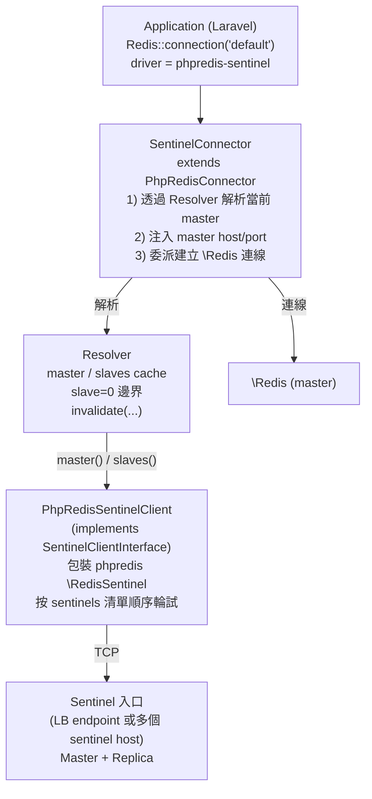
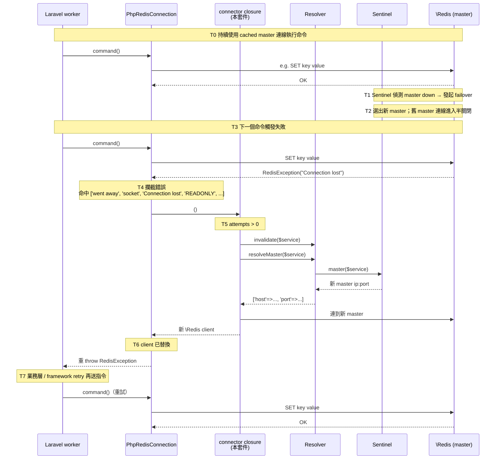

# `Lab104\Laravel\Redis\Sentinel` 機制說明

本文件說明 `src/Sentinel/` namespace 的設計、運作方式與實機行為，供應用端整合與 Sentinel failover 演練時參考。

## 1. 架構總覽



## 2. 元件職責

| 類別 / 介面 | 職責 |
|---|---|
| `ResolverInterface` | 對外契約：`resolveMaster()` / `resolveSlaves()` / `invalidate()` |
| `Resolver` | 內含 master / slaves cache、`slave=0` 邊界、lazy 建立 `SentinelClientInterface` |
| `SentinelClientInterface` | Sentinel 端唯讀查詢介面（`master()` / `slaves()`），讓 Resolver 純單元測試可 mock |
| `PhpRedisSentinelClient` | `SentinelClientInterface` 的 phpredis 實作；按 sentinels 清單順序輪試直到任一 Sentinel 可連 |
| `SentinelConnector` | 繼承 `Illuminate\Redis\Connectors\PhpRedisConnector`，先解析 master 再委派 phpredis 建立 `\Redis` |
| `SentinelServiceProvider` | composer auto-discover 自動註冊 `phpredis-sentinel` driver 到 Laravel `RedisManager` |
| `SentinelException` | Sentinel 解析 / 連線失敗的領域例外（`RESOLVE_ERROR` / `CONNECTION_ERROR`） |

## 3. master / slave 解析流程

### 3.1 第一次解析

1. `SentinelConnector::connect($config, $options)` 被 Laravel 呼叫
2. 取出 `service`（master group）與 `sentinels`（Sentinel 入口列表）後建立 `Resolver`
3. 觸發 `Resolver::resolveMaster($service)` → cache miss
   - 透過 `SentinelClientInterface::master($service)` 向 Sentinel 查詢
   - 驗證 `flags` 不含 `s_down` / `o_down` / `disconnected`、`role-reported == master`
   - 結果寫入 `masterCache[$service]`
4. 將 `host` / `port` 注入 phpredis 設定，呼叫 `PhpRedisConnector::createClient()` 建立 `\Redis` 連線
5. 包成 `Illuminate\Redis\Connections\PhpRedisConnection` 回傳，Laravel 後續以此 client 操作 Redis

### 3.2 後續解析（同 process 內）

* `resolveMaster()` / `resolveSlaves()` 直接 hit cache，不再 query Sentinel
* `Resolver` 內的 `\RedisSentinel` 連線也是 lazy 建立並沿用，不會每次重連 Sentinel

### 3.3 例外行為

| 條件 | 行為 |
|---|---|
| Sentinel 回傳 `false` 或 `[]`（master 不存在） | 拋 `SentinelException::masterNotFound($service)` |
| `flags` 含 `s_down` / `o_down` / `disconnected` | 拋 `SentinelException::masterDown($service, $flags)` |
| `role-reported != 'master'` | 拋 `SentinelException::masterRoleMismatch(...)` |
| Sentinel client 建立失敗（所有 sentinels 全失聯） | 拋 `SentinelException`（`CONNECTION_ERROR`），訊息含最後一次 underlying error，`previous` 保留 chain |

flags 比對採 token-based（逗號 split + array_intersect），避免「子字串包含 `down`」的誤判
（例：未來 Sentinel 加入 `xxx_countdown` / `shutdown_pending` 等含 `down` 子字串但語意非 master down 的 flag）。
slave 過濾額外含 `master_link_down`（slave 與 master 連線斷、資料可能落後）。

## 4. Connection cache 失效策略

`Resolver` 採用 **process in-memory + 失敗才重 query** 策略。

### 4.1 何時 *不會* 重 query Sentinel

* 第二次以後對同一 `service` 呼叫 `resolveMaster()` / `resolveSlaves()`
* 應用 worker 一直健康執行、Redis master 沒有 failover

### 4.2 何時 *會* 重 query Sentinel

| 觸發點 | 機制 |
|---|---|
| `\Redis` 操作丟連線錯誤（`Connection lost` / `went away` / socket error / `READONLY` …） | Laravel `PhpRedisConnection::command()` 會呼叫 `$this->connector` 重建 client；本套件的 connector closure 在 `attempts > 0` 時先 `Resolver::invalidate($service)` 再解析新 master |
| 應用層主動呼叫 `Resolver::invalidate($service)` | 清掉指定 service 的 master / slaves cache（其他 service 保留） |
| 應用層主動呼叫 `Resolver::invalidate()`（不帶參數） | 清掉所有 service cache **並丟棄底層 `\RedisSentinel` 連線**；下次解析重新建立 Sentinel 連線 |

### 4.3 設計理由

* **不設 TTL**：Sentinel 觸發 failover 時應用必然會收到連線錯誤，由錯誤觸發 invalidate 比定時失效更精準、減少 Sentinel 流量。
* **不在 process 之間共享 cache**：避免新增 Redis / file IO 等共用儲存的依賴；每個 worker 各自重 query 是可接受的。
* **invalidate 不帶參數會丟棄 `\RedisSentinel` 連線**：用於懷疑 Sentinel 入口本身斷線的情況；此操作較重，僅 hard reset 才用。

## 5. Reconnect 與 failover 行為

### 5.1 失敗 → 重連的時序



### 5.2 為什麼不在 Connector 層自動重試命令

Laravel 既有的 `PhpRedisConnection` 設計就是「重建 client，不重試指令」。重試與否屬於業務語義
（例：寫入是否冪等），由應用層 / queue framework / phpredis 內建 `setOption(OPT_MAX_RETRIES, ...)` 決定，
本套件刻意不擴張到此範圍以避免雙重重試。

### 5.3 `attempts` 計數的累積行為

`makeMasterResolverClosure()` 內的 `$attempts` 在 closure 整個生命週期單調遞增：

* 首次呼叫 `attempts == 0`，不 invalidate（沿用初始 cache）
* 第二次起 `attempts > 0`，每次都 invalidate 後重 query Sentinel

在 Octane / Swoole 等 long-running worker 中，**單一 worker process 的 connection 生命週期會跨多 request**，
意味著「短暫網路抖動 → reconnect 成功 → 後續長時間穩定」的情境下，下一次 reconnect 也會 invalidate
一次（多走一次 Sentinel 查詢）。語義上保守、副作用是每次 reconnect 多一次 Sentinel 流量，避免出現
「靠舊 cache 連到舊 master」的死路。如 Sentinel 流量需要嚴格控制再評估改為「成功時 reset attempts」的設計。

### 5.4 應用端整合需驗證的行為

* Sentinel `down-after-milliseconds` × `failover-timeout` × `parallel-syncs` 對應用端的可見延遲
* `min-replicas-to-write` 與一致性的取捨
* Octane / Swoole long-running worker 在 master 切換後是否需要 worker 重啟才釋放舊連線

## 6. `slave=0` 邊界處理

### 6.1 規格與動機

當 Sentinel 回傳 slave list 為 0（例：dev/staging 只有 master、或 prod failover 期間所有 slave 都暫時 down）時，
應用端讀流量會無處可去。`Resolver::fetchSlaves()` 在此情境下把 master 加入清單作為 fallback：

```php
if (count($list) === 0) {
    $list[] = $this->resolveMaster($service);
}
```

### 6.2 涵蓋情境

| Sentinel 回應 | `Resolver::resolveSlaves()` 結果 |
|---|---|
| `[]`（沒有 slave 已註冊） | `[ master ]` |
| 全部 slave 含 `flags=*down*` | `[ master ]`（過濾後 list 為空，再 fallback） |
| `false`（部分 phpredis 版本可能回 false） | `[ master ]` |
| 1 個 healthy slave | `[ slave ]` |
| 多個 slave（含部分 down） | 過濾掉 down 的後回傳 healthy slaves |

### 6.3 單元測試覆蓋

`tests/Unit/Sentinel/ResolverTest.php`：

* `itFallsBackToMasterWhenSlaveListIsEmpty`
* `itFallsBackToMasterWhenAllSlavesAreDown`
* `itFallsBackToMasterWhenSentinelReturnsFalseForSlaves`
* `itFiltersOutDownSlaves`

## 7. 測試覆蓋清單

| 測試檔 | 測試項數 | 覆蓋面向 |
|---|---|---|
| `tests/Unit/Sentinel/ResolverTest.php` | 21 | master / slaves 解析、cache、`slave=0` 邊界、down 過濾（token-based）、`disconnected` / `master_link_down`、role-reported 驗證、invalidate 行為、lazy client、builder throw 後 retry |
| `tests/Unit/Sentinel/SentinelConnectorTest.php` | 7 | reconnect 時 invalidate 觸發點、attempts 計數獨立性、必填 config 驗證、sentinels 結構錯誤訊息含 index |
| `tests/Unit/Sentinel/PhpRedisSentinelClientTest.php` | 6 | 建構參數驗證、sentinel 順序輪試、全失敗時 `previous` chain（最後 underlying error 不丟失） |

> 整合測試（連實機 Sentinel + 手動觸發 failover 驗證 reconnect）由應用端負責；
> 本套件不維護整合測試以避免綁定特定 Sentinel 部署。

## 8. 設定 / `.env` 對應

### 8.1 `config/database.php`

```php
'redis' => [
    'client' => 'phpredis',

    'default' => [
        'driver'             => 'phpredis-sentinel',
        'service'            => env('REDIS_SENTINEL_SERVICE'),
        'sentinels'          => collect(explode(',', env('REDIS_SENTINELS', '')))
            ->filter()
            ->map(fn (string $hp) => [
                'host' => explode(':', $hp)[0],
                'port' => (int) (explode(':', $hp)[1] ?? 26379),
            ])
            ->values()
            ->all(),
        // sentinel_connect_timeout / sentinel_read_timeout 各自獨立；不設則 fallback 到 sentinel_timeout
        'sentinel_connect_timeout' => env('REDIS_SENTINEL_CONNECT_TIMEOUT'),
        'sentinel_read_timeout'    => env('REDIS_SENTINEL_READ_TIMEOUT'),
        'sentinel_timeout'   => (float) env('REDIS_SENTINEL_TIMEOUT', 0.5),
        'sentinel_password'  => env('REDIS_SENTINEL_PASSWORD'),

        // 一般 phpredis 設定（解析到 master 後一併套用）
        'password'           => env('REDIS_PASSWORD'),
        'database'           => (int) env('REDIS_DB', 0),
        'read_write_timeout' => (float) env('REDIS_READ_WRITE_TIMEOUT', 0),
    ],
],
```

### 8.2 必要 `.env` 變數

| 變數 | 說明 |
|---|---|
| `REDIS_SENTINELS` | Sentinel 入口清單（單一 LB 或多個 sentinel host），逗號分隔 `host:port`（例：`sentinel.example.com:26379` 或 `sentinel-a:26379,sentinel-b:26379,sentinel-c:26379`） |
| `REDIS_SENTINEL_SERVICE` | Sentinel master group 名稱（例：`mymaster`） |
| `REDIS_SENTINEL_CONNECT_TIMEOUT` | （選）連 Sentinel 的 connect timeout；不設則 fallback 到 `REDIS_SENTINEL_TIMEOUT` |
| `REDIS_SENTINEL_READ_TIMEOUT` | （選）連 Sentinel 的 read timeout；不設則 fallback 到 `REDIS_SENTINEL_TIMEOUT` |
| `REDIS_SENTINEL_TIMEOUT` | （選）connect / read timeout 的共用 fallback（預設 0.5） |
| `REDIS_SENTINEL_PASSWORD` | （選）Sentinel 端 ACL 密碼 |
| `REDIS_PASSWORD` | master / replica 的密碼（與既有設定相同） |

> 「Sentinel 失聯偵測」與「Sentinel 查詢回應」是兩種特性，可分別調整 `REDIS_SENTINEL_CONNECT_TIMEOUT`（短，例 0.3）與 `REDIS_SENTINEL_READ_TIMEOUT`（略長，例 1.0）。一般情境用 `REDIS_SENTINEL_TIMEOUT` 即可。

### 8.3 Rollback fallback

切換期間建議在 `config/database.php` 保留原 `REDIS_HOST` 對應的 connection 設定，並透過
deployment 的環境變數切換 driver；不要刪除舊變數，rollback 時以環境變數變更即可恢復。

## 9. 故障排除

| 症狀 | 可能原因 | 排查 |
|---|---|---|
| 啟動時拋 `SentinelException`（`CONNECTION_ERROR`） | 所有 sentinels 都連不到 / 認證錯誤 | 檢查 `REDIS_SENTINELS` 是否可達；確認 `REDIS_SENTINEL_PASSWORD` |
| 啟動時拋 `TypeError` / `Class RedisSentinel not found` | ext-redis < 6.0 或未啟用 | `php --re redis | grep RedisSentinel` 或 `php -r "echo phpversion('redis');"` 確認版本 ≥ 6.0；composer suggest 段落已宣告此需求 |
| 啟動時拋 `master group [...] not found` | `REDIS_SENTINEL_SERVICE` 與 Sentinel 端設定不符 | 確認 master group 名稱 |
| 啟動時拋 `master group [...] reported down` | Sentinel 端短暫看到 master down | 重試啟動；若持續 → 聯絡資料庫端維運 |
| 寫入時偶發 `Connection lost` 但下一次成功 | 正常 failover 流程 | 觀察 retry 機制是否有把命令重送 |
| `Octane` worker 在 failover 後仍打到舊 master | worker 仍持有舊 \Redis client | 需重啟 worker，或於 `octane.php` 配置 `DisconnectFromDatabases` listener |

## 10. 套件版本相容

* PHP `^8.1`
* Laravel `^10` / `^11` / `^12`
* `ext-redis >= 6.0`（`\RedisSentinel` array constructor）
* 既有 `Lab104\Laravel\Redis\KeysByScan` 用法**不受影響**，可與 Sentinel namespace 並存使用
